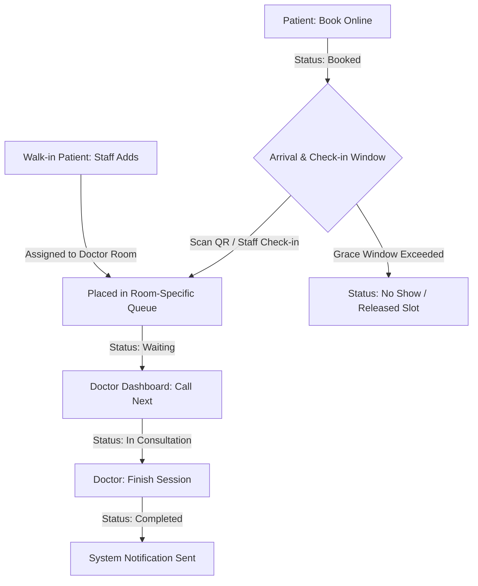

# Smart Healthcare Availability & Queue Management System

This document outlines the clarified, real-time room-based queue management flow of the **Smart Healthcare Availability & Queue Management System (SHQMS)**. It describes how actor roles, room configurations, queue assignment, and active statuses synchronize dynamically to optimize the doctor's consultation workflow.

---

## 1. Unified Actors & Permission Roles

The system operates with strict segregation of duties between three main roles:

| Actor Role | Live Queue Permission | Action Rights |
| :--- | :--- | :--- |
| 🧑‍⚕️ **Doctor** | View own room queue | **Full Control** (Call next, mark completed, hold session) |
| 📋 **Staff (Receptionist/Nurse)** | View all queues per room | **Full Control** (Check-in patients, register walk-ins, cancel/remove patients) |
| 👑 **Admin** | View all queues per room | **Monitoring Only** (Read-only view, cannot add walk-ins or modify active queues) |

---

## 2. Queue Lifecycle Workflow

SHQMS coordinates online appointments and walk-in flows dynamically, prioritizing physically checked-in waiting patients per room:



---

## 3. Dynamic Room-Based Queue Logic

Instead of a single global queue channel, **queues are completely room-based**. 
* **Dynamic Room Configuration**: The active room count is decided automatically by the Admin when scheduling doctors. Each active regular doctor schedule has an assigned `room` column.
* **Autonomous Channels**: If 3 doctors are scheduled today, the system automatically opens 3 side-by-side queues corresponding to those rooms.
* **Doctor Alignment**: Doctors see only the queue specific to the room assigned in their day's schedule.

---

## 4. Patient Status Transitions

Each patient in the system flows through a set of standardized statuses:

* **Booked**: Patient completed online scheduling but has not physically checked in at the clinic.
* **Waiting**: Patient checked in (via QR scan or staff validation) and is placed in their room's active queue.
* **In Consultation**: Doctor is currently serving the patient in the designated room.
* **Completed**: The consultation has ended successfully.
* **Cancelled / No Show**: The patient failed to check in on time, or staff removed them, releasing the slot.

---

## 5. Room-Specific Queue Number Assignments

To prevent patient confusion across separate consulting rooms, queue numbers are room-specific and utilize unique room-prefix letter codes:

```text
Room 1 (Cardiology) ──> Assigned Prefix 'A' ──> Queue Numbers: A001, A002, A003...
Room 2 (Pediatrics) ──> Assigned Prefix 'B' ──> Queue Numbers: B001, B002, B003...
Room 3 (General Med) ──> Assigned Prefix 'C' ──> Queue Numbers: C001, C002, C003...
```

* **Walk-in Alignment**: When Staff registers a walk-in patient, the system assigns them to the appropriate room's upcoming sequence (e.g., if Room 1 has `A001` and `A002`, the walk-in becomes `A003`).

---

## 6. Handling Grace Periods & No-Shows

To keep room consultations flowing at peak efficiency:
* **Check-in Deadline**: Appointment patients must check in within a defined time window (e.g. 15 minutes before or after their slot start).
* **Automated Cancellation**: If they exceed this window, the system marks the record as `No Show`, releasing the slot.
* **Standby Insertion**: Staff can then seamlessly insert walk-in standby patients or late-checked-in patients into that freed-up queue space.
