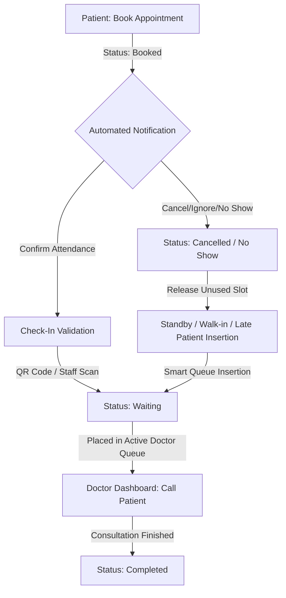

# Smart Healthcare Availability & Queue Management System

This document explains the dynamic, real-time queue management flow designed to reduce patient waiting times, prevent clinic congestion, and optimize doctor utilization.

---

## 1. Queue Lifecycle Workflow



---

## 2. Dynamic Queue Flow Lifecycle Stages

### 📅 Stage 1: Appointment Scheduling
Patients schedule an appointment online or through the clinic portal. They must select:
* Healthcare Service
* Assigned Doctor
* Preferred Schedule & Time Range
* Reason for Visit

> [!NOTE]
> Upon booking, the patient's status is initialized as **Booked**. At this stage, they are **not** yet placed in the active serving queue to avoid blocking slots.

| Patient | Schedule | Status |
| :--- | :--- | :--- |
| John Doe | 10:00 AM – 11:00 AM | **Booked** |

---

### 🔔 Stage 2: Automated Notification Process
To minimize no-shows and ensure optimal patient flow:
* **1-Hour Reminder**: The system sends an SMS/Email notification.
* **30-Minute Reminder**: A second notification is sent before the scheduled time slot.

The patient can:
1. **Confirm Attendance** (signals arrival prep).
2. **Cancel Appointment** (frees up slot).
3. **Ignore / No-Show** (triggers grace period check).

---

### 🔑 Stage 3: Patient Check-In Validation
Upon arrival at the clinic, the patient must check in via:
* Clinic Staff manual check-in
* QR code scanner check-in
* Patient portal confirmation

> [!IMPORTANT]
> **Check-In Validation Formula:**
> ```text
> Booked ──[Check-In Completed]──> Waiting
> ```
> Only patients under the **Waiting** status are visible on the Doctor's live dashboard. Absent or non-checked-in patients remain outside the active queue.

| Patient | Schedule | Check-In Done | Status |
| :--- | :--- | :--- | :--- |
| John Doe | 10:00 AM – 11:00 AM | **Yes** | **Waiting** (Active) |
| Ana Cruz | 10:00 AM – 11:00 AM | **No** | **Booked** (Inactive) |

---

### 🔄 Stage 4: Dynamic Active Queue System
Unlike traditional static queue numbers, the system uses a **Dynamic Waiting Pool**:
* The doctor's queue only lists checked-in patients who are physically present.
* Absent patients with earlier appointments do not stall the doctor's queue.

**Example Active Queue Sequence:**
1. **John Doe** (Checked-In, 10:00 AM)
2. **Mark Reyes** (Checked-In, 10:15 AM)
3. **Ken Santos** (Checked-In, 10:30 AM)

---

### ⏱️ Stage 5: Flexible Late Patient Policy
The system accommodates late arrivals without penalizing punctual patients.

```text
Appointment Schedule: 10:00 AM – 11:00 AM
Allowed Check-In Window: 9:45 AM – 10:30 AM (45-Minute Window)
```

> [!TIP]
> Late patients who check in within the grace window but after their designated start time will be inserted into upcoming empty slots, but **will not** override already-waiting punctual patients.

---

### ⚡ Stage 6: Smart Queue Insertion Logic
If an appointment is cancelled or a patient is a no-show, the system dynamically inserts walk-ins or late arrivals into the empty slot.

```text
Original Active Queue:
John Doe ──> Mark Reyes (Absent) ──> Ken Santos

No-Show Update:
John Doe ──> Ken Santos

Late Arrival (Ana) Inserted:
John Doe ──> Ken Santos ──> Ana Cruz (Late)
```

---

### 🚫 Stage 7: No-Show Management
If a patient fails to check in before the **Check-in Deadline** (45 minutes into their appointment block), their status changes automatically:

```text
Booked ──[Deadline Exceeded]──> No Show
```

* The system removes them from active queues.
* The slot is released immediately for walk-in patients or late arrivals.

---

### 🚶 Stage 8: Walk-In Patient Integration
Walk-in patients enter a **Standby Queue System**:
* Scheduled appointments retain base priority.
* Walk-in patients are inserted into the queue only when there is an unused slot, a no-show, or when a doctor completes a consultation earlier than expected.

---

### 🩺 Stage 9: Doctor & Staff Dashboards
* **Doctor Dashboard**: Displays a clean, real-time list of checked-in patient queues. Doctors can **Call Next**, **Skip/Pause**, or mark consultations as **Completed** (which automatically advances the queue).
* **Staff Dashboard**: The primary control tower for checking in patients, registering walk-ins, monitoring waiting pools, and overriding no-show statuses.

---

## 3. Queue Structures by Clinic Division

The system supports multiple queue channels separated by doctor specialization or clinic department:

| Specials Department | Queue Channel | Queue Status |
| :--- | :--- | :--- |
| **Pediatrics** | Channel A | Active |
| **Cardiology** | Channel B | Active |
| **Laboratory** | Channel C | Standby |
