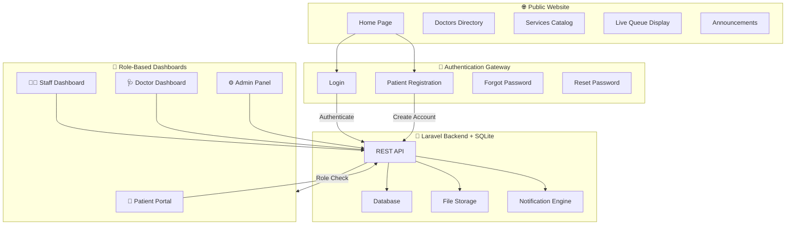
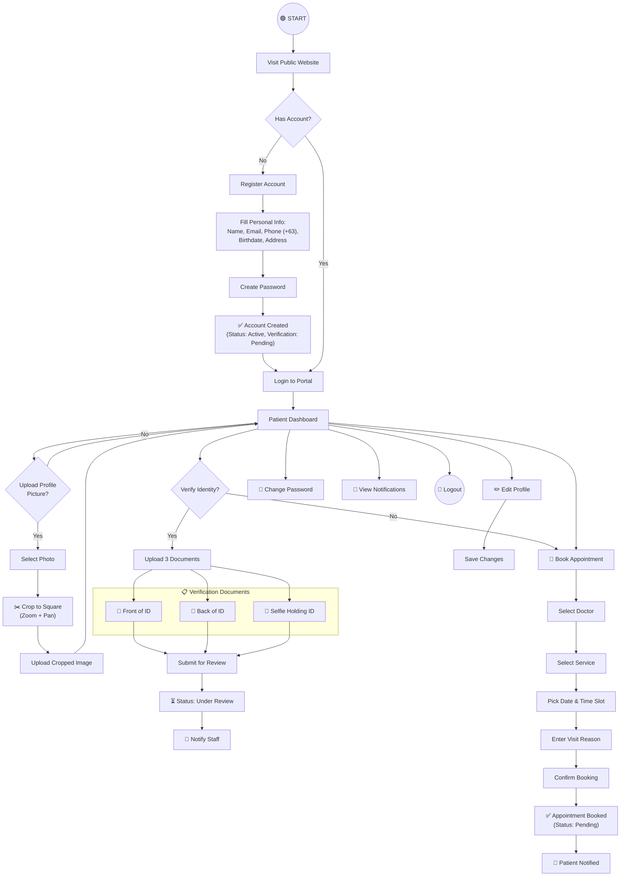
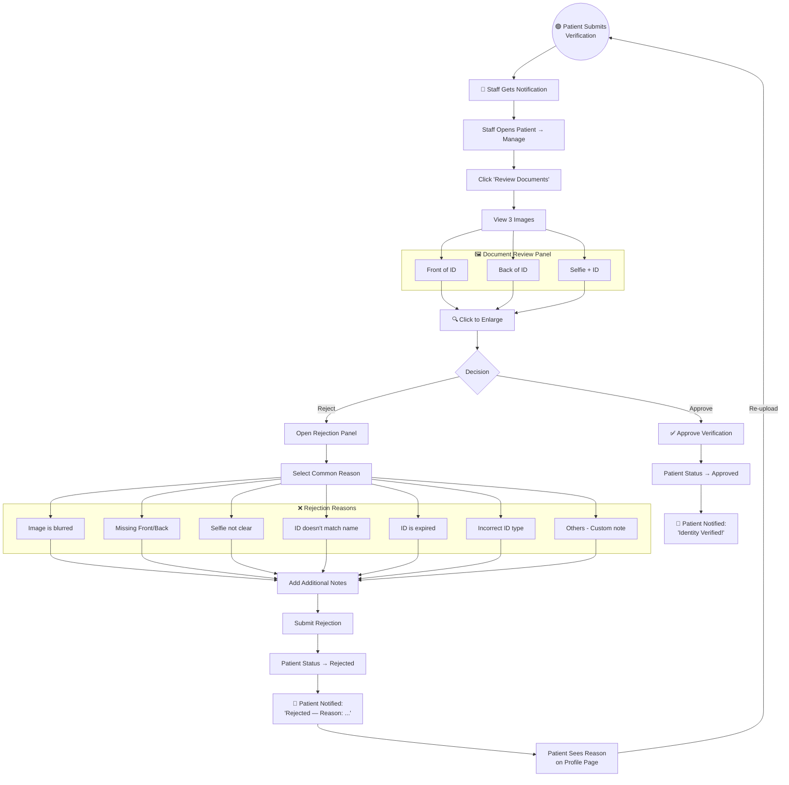
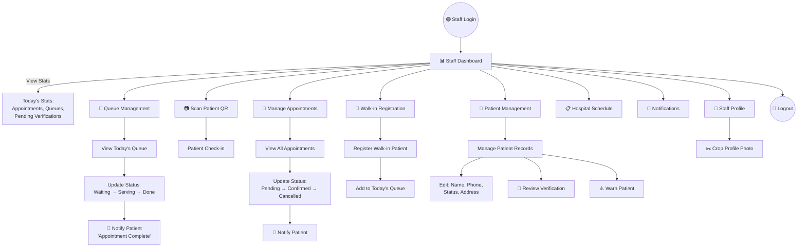
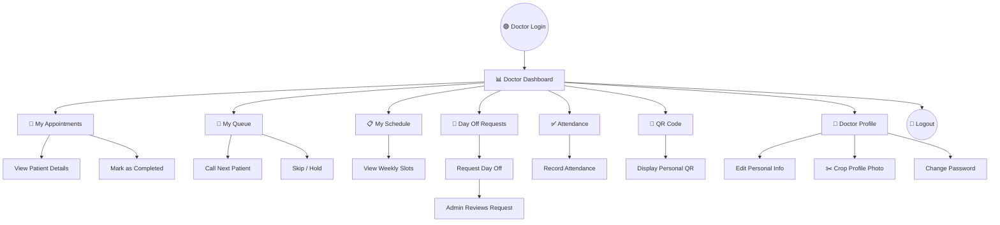
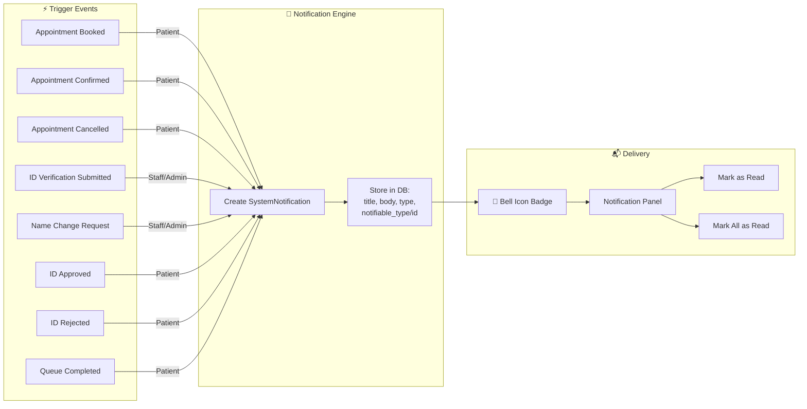
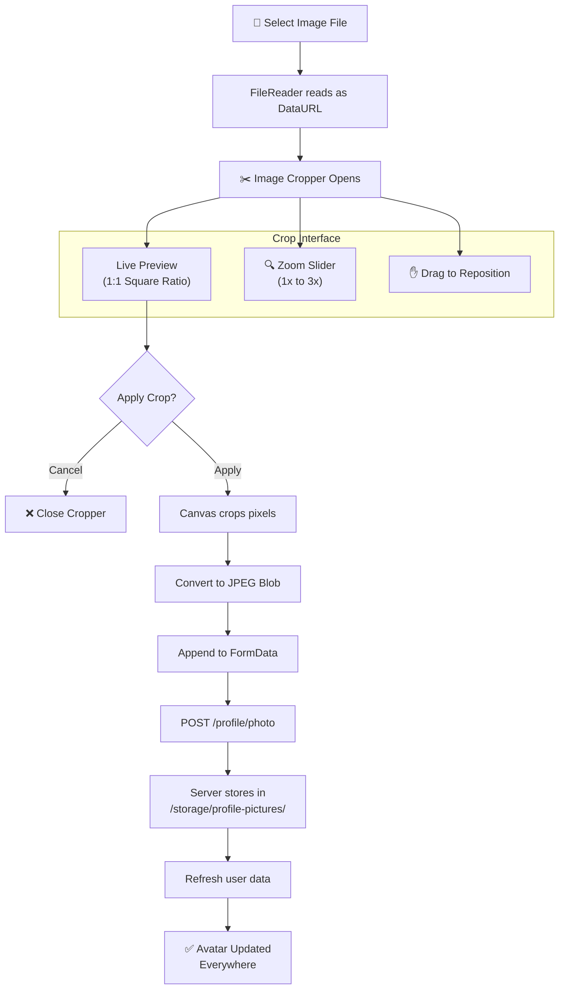
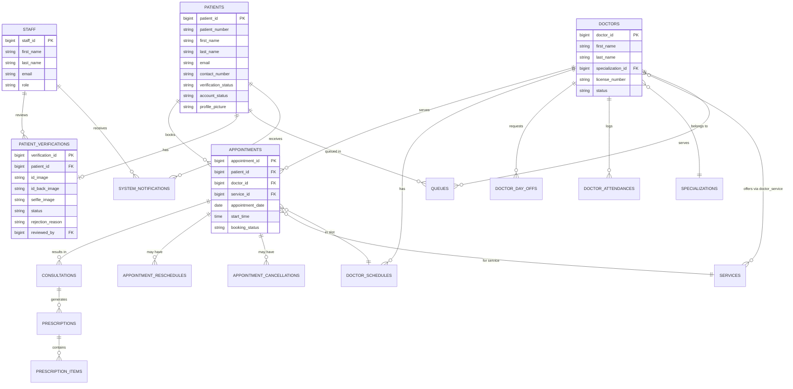

# 🏥 HealthCare Clinic Queue & Appointment System — Complete Flowchart

---

## 1. System Overview — High Level Architecture

---

## 2. Patient Journey — Registration to Appointment

---

## 3. ID Verification Review — Staff/Admin Flow

---

## 4. Staff Operations — Daily Workflow

---

## 5. Doctor Operations — Clinical Workflow

---

## 6. Admin Operations — System Management

```mermaid
flowchart TD
    ADMIN_LOGIN(("🟢 Admin Login")) --> ADMIN_DASH["📊 Admin Dashboard"]
    
    ADMIN_DASH --> MGT_DOC["🩺 Manage Doctors"]
    MGT_DOC --> ADD_DOC["Add Doctor"]
    MGT_DOC --> EDIT_DOC_A["Edit Doctor"]
    MGT_DOC --> TOGGLE_DOC["Activate / Deactivate"]
    
    ADMIN_DASH --> MGT_STAFF["🧑‍💼 Manage Staff"]
    MGT_STAFF --> ADD_STAFF["Create Staff Account<br/>(Temp Password)"]
    MGT_STAFF --> EDIT_STAFF["Edit Staff Details"]
    
    ADMIN_DASH --> MGT_PAT_A["👥 Manage Patients"]
    MGT_PAT_A --> EDIT_PAT_A["Edit Patient Records"]
    MGT_PAT_A --> VERIFY_A["🪪 Review Verification"]
    MGT_PAT_A --> WARN_A["⚠️ Warn / Suspend"]
    
    ADMIN_DASH --> MGT_SVC["🏥 Manage Services"]
    MGT_SVC --> ADD_SVC["Add Service"]
    MGT_SVC --> EDIT_SVC["Edit Service"]
    MGT_SVC --> DEL_SVC["Delete Service"]
    
    ADMIN_DASH --> MGT_SCHED["📅 Manage Schedules"]
    MGT_SCHED --> ADD_SCHED["Create Doctor Schedule"]
    MGT_SCHED --> DEL_SCHED["Delete Schedule"]
    
    ADMIN_DASH --> MGT_DAYOFF["🌴 Day Off Requests"]
    MGT_DAYOFF --> APPROVE_OFF["Approve / Reject"]
    
    ADMIN_DASH --> REPORTS["📈 Reports"]
    REPORTS --> STATS_A["View Analytics:<br/>Appointments, Patients,<br/>Revenue Summary"]
    
    ADMIN_DASH --> ADMIN_NOTIFS["🔔 Notifications"]
    ADMIN_DASH --> SETTINGS["⚙️ Account Settings"]
    SETTINGS --> EDIT_ADMIN["Edit Admin Info"]
    SETTINGS --> CROP_ADMIN["✂️ Crop Profile Photo"]
    SETTINGS --> PW_ADMIN["Change Password"]
    
    ADMIN_DASH --> LOGOUT_A(("🔴 Logout"))
```

---

## 7. Notification System Flow

---

## 8. Profile Picture Upload Flow — All Roles

---

## 9. Database Entity Relationships

---

## 10. Technology Stack Summary

| Layer | Technology | Purpose |
|---|---|---|
| **Frontend** | React 19 + Vite 7 | UI Components & Routing |
| **Styling** | Tailwind CSS 3 | Responsive Dark/Light Mode |
| **Icons** | React Icons + Lucide | UI Iconography |
| **Charts** | Recharts | Dashboard Analytics |
| **Image Crop** | react-easy-crop | Profile Picture Formatting |
| **Backend** | Laravel (PHP) | REST API + Auth |
| **Auth** | Sanctum Tokens | Session/Token Management |
| **Database** | SQLite | Local Persistent Storage |
| **File Storage** | Laravel Storage (public) | Profile Pictures & ID Images |
| **Notifications** | SystemNotification Model | In-App Real-Time Alerts |
